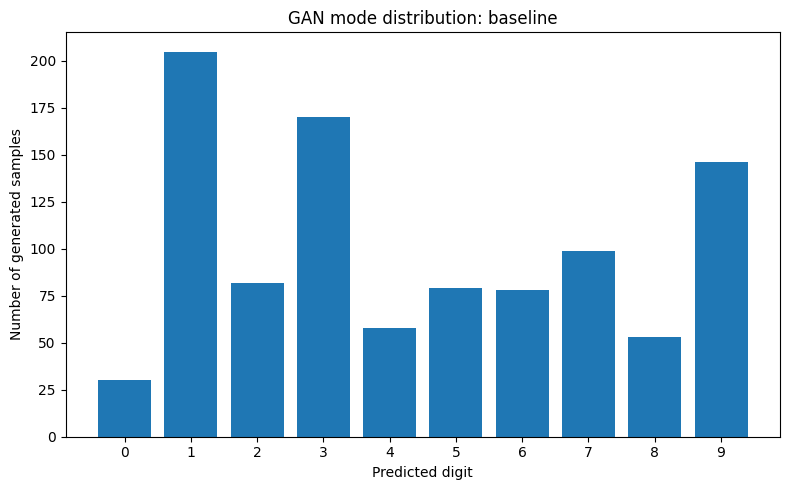
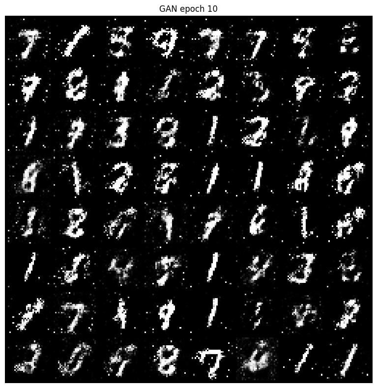
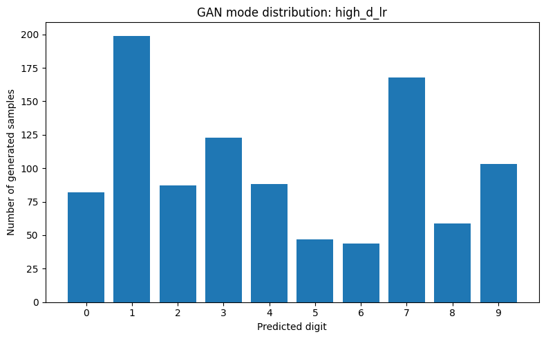
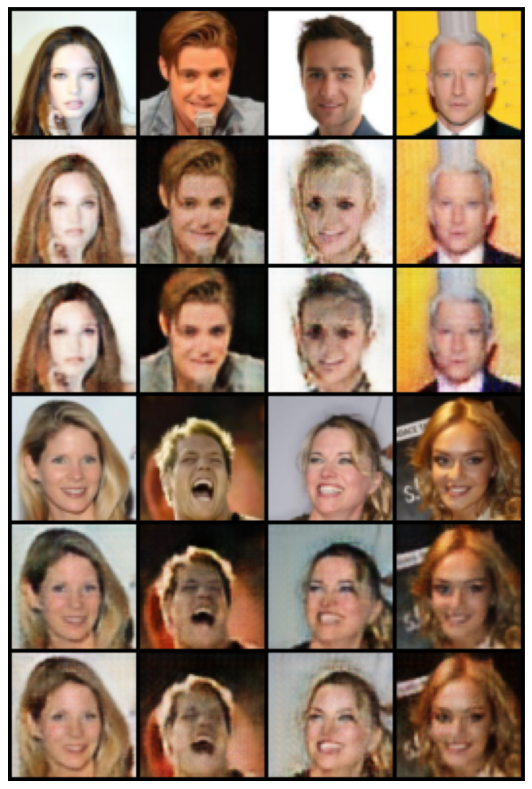
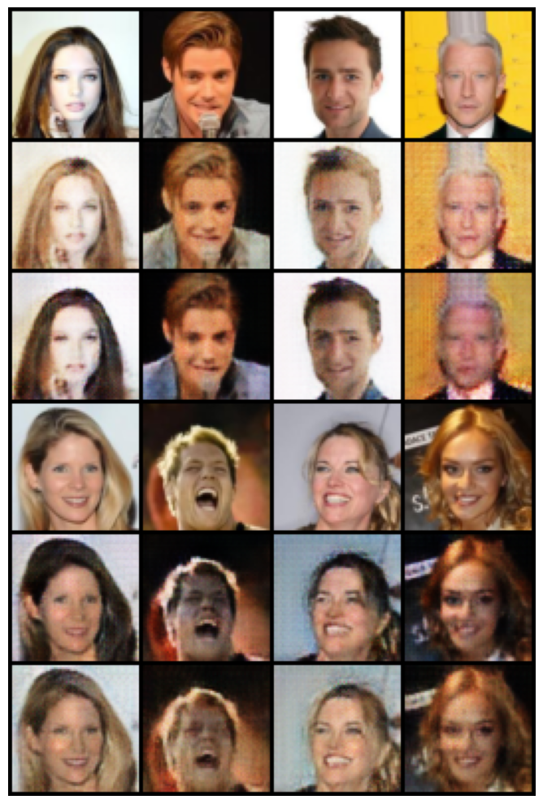
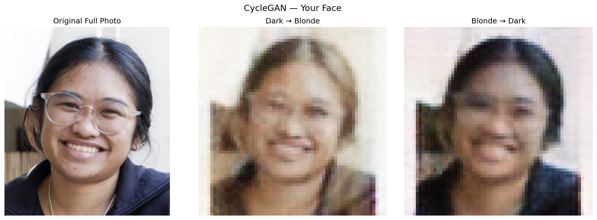
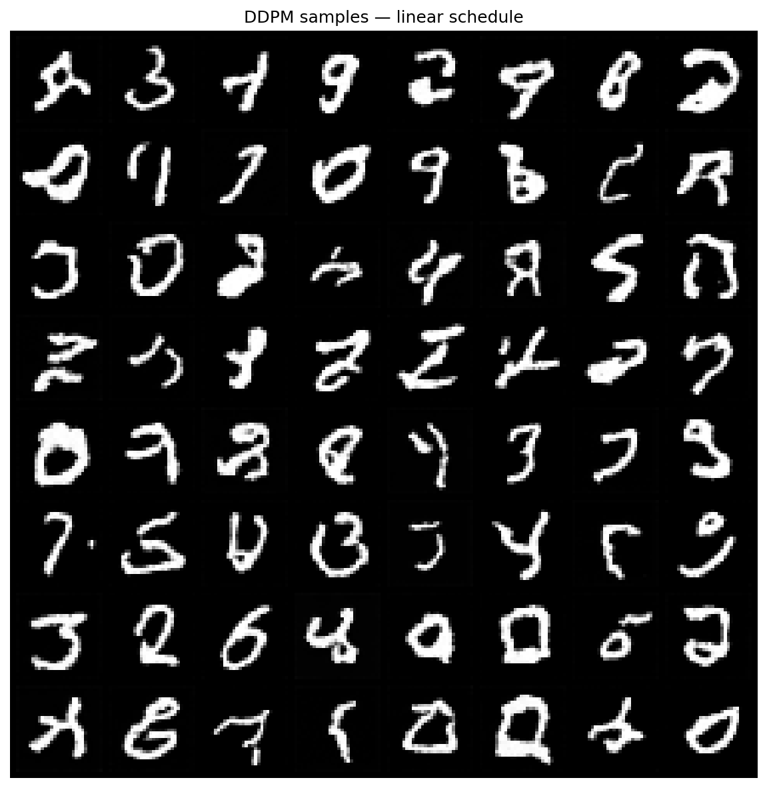
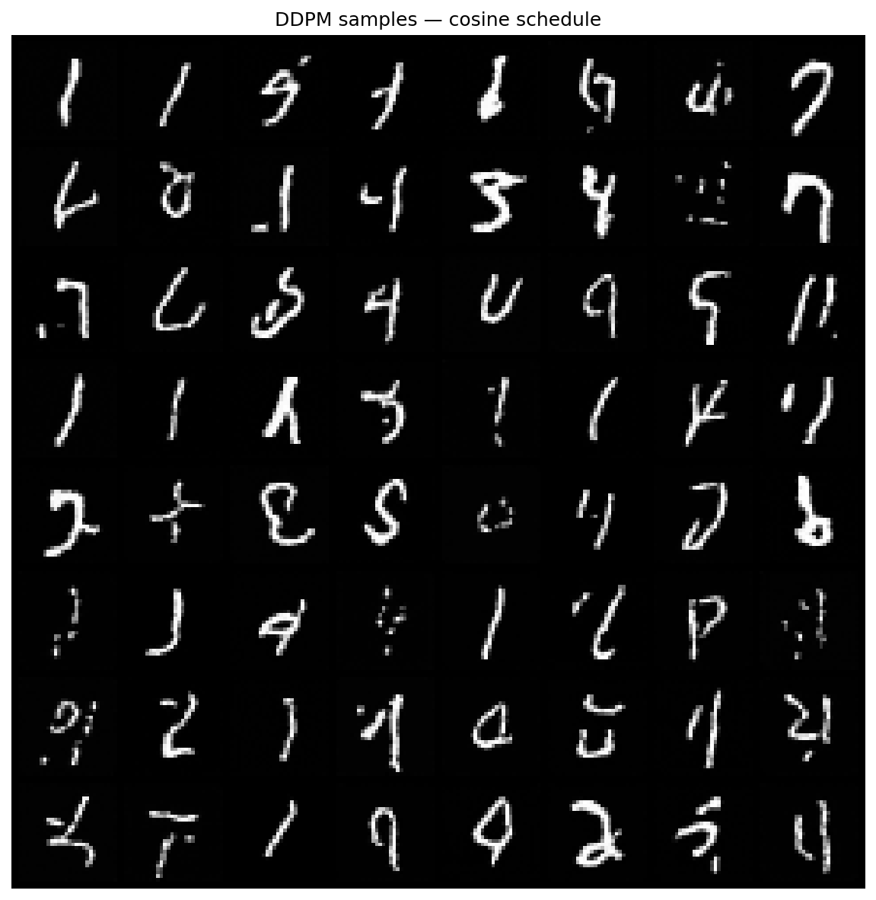

# A4 Generative Models

## Overview

This assignment investigates three types of generative models: a Generative Adversarial Network (GAN), a Cycle-Consistent Generative Adversarial Network (CycleGAN), and a Denoising Diffusion Probabilistic Model (DDPM). The models are implemented in PyTorch and trained using the MNIST and CelebA datasets. The assignment combines model implementation, experimental comparison, visualization, and analysis of generated results.

The project is organized into separate modules for model architectures, dataset loading, training procedures, evaluation, utility functions, and inference. A central ```run.py``` file provides a command-line interface for training and evaluating each model.

## Trining Script

```bash
# Train Vanilla GAN on MNIST
!python run.py \ --model gan \ --dataset mnist \ --epochs 20 --train

# Train GAN with learning rate 0.0006
!python run.py \ --model gan \ --dataset mnist \ --epochs 20 \ --discriminator-lr 0.0006 \ --train

# Train cycleGAN on CelebA
!python run.py \ --model cyclegan \ --dataset celeba \ --epochs 10 --batch-size 16 \ --max-samples 5000 \ --lambda-cyc 10 \ --lambda-idt 5 \ --train

# Test CycleGAN with your own face
!python test_face.py

# DDPM with linear schedule 
!python run.py \ --model ddpm \ --dataset mnist \ --epochs 10 \ --batch-size 128 \ --schedule linear \ --train

#DDPM with cosine schedule
!python run.py \ --model ddpm \ --dataset mnist \ --epochs 10 \ --batch-size 128 \ --schedule cosine \ --train
```
I train on google colab using A100 GPU.

## Results Table
| Model | Dataset | Visual Quality | Training Time | Notes |
|---|---|---|---|---|
| Vanilla GAN | MNIST | 3/5 | ~7s | mode collapse check lr_D=6e-4|
| CycleGAN | CelebA | 4/5 | ~34.3s | dark↔blonde 50K/domain|
| DDPM (linear) | MNIST | 3/5 | ~6.6s | baseline, Generated digits are recognizable |
| DDPM (cosine) | MNIST | 4/5 | ~6.6 | better visual quality than the linear schedule, with clearer and more recognizable digits |

I would use a GAN when fast generation is important and the target domain is relatively simple, but I would monitor carefully for unstable training and mode collapse. I would use CycleGAN for unpaired image-to-image translation, such as changing hair colour or converting one visual style into another, especially when paired examples are unavailable. I would use a diffusion model when image quality, diversity, and training stability are more important than generation speed. Based on these experiments, diffusion is the strongest choice for high-quality synthesis, while GANs are faster and CycleGAN is best suited to domain translation.

## Exercise 

### 1. GAN Mode Collapse

Mode collapse occurs when the generator produces only a few types of outputs, ignoring most of the data distribution.

a) After training the Vanilla GAN, generate 1000 images and classify them using a pretrained MNIST classifier. Fill in the table:

| Digit | 0 | 1 | 2 | 3 | 4 | 5 | 6 | 7 | 8 | 9 |
|---|---|---|---|---|---|---|---|---|---|---|
| Count (out of 1000) | 30 | 205 | 82 | 170 | 58 | 79 | 78 | 99 | 53 | 146 |



b) Intentionally cause mode collapse: set the discriminator learning rate to 6e-4 (3× default)

c) Describe two techniques that help prevent mode collapse
    
    1. Wasserstein GAN (WGAN)

    WGAN replaces the standard GAN loss with the Wasserstein distance, which gives the generator smoother and more informative gradients even when the real and generated distributions have little overlap. This helps prevent mode collapse because the generator is less likely to get stuck producing only a small set of outputs. In practice, WGAN uses a critic instead of a probability-based discriminator and enforces a Lipschitz constraint using either weight clipping or, more effectively, a gradient penalty.

    2. Minibatch discrimination

    Minibatch discrimination allows the discriminator to compare samples within the same batch instead of judging each image independently.If the generator produces many very similar images, the discriminator can detect the lack of diversity and penalize it. This encourages the generator to produce a wider range of samples rather than repeatedly generating the same digit or image pattern.

### 2. CycleGAN Ablation — Cycle Consistency

The cycle consistency loss is what makes CycleGAN work without paired data.

a) Re-train with `LAMBDA_CYC = 0` (disabled) for 10 epochs. Compare the translation quality:

| Setting | Visual quality | Face structure preserved? | Notes |
|---|---|---|---|
| λ_cyc = 10 (default) | Better and more consistent translation | mostly preserved | Hair colour changes while the person’s identity, facial shape, pose, and background are generally retained. Some artifacts may still appear because of limited training and low image resolution. |
| λ_cyc = 0 | Less stable | poorly preserved | Without cycle-consistency loss, the generator only needs to fool the discriminator. |

b) 4 example translations from each setting

λ_cyc = 0


λ_cyc = 10


c) Without cycle consistency, the generator only needs to produce an image that looks like it belongs to the target domain. It can therefore “cheat” by generating a generic realistic target-domain face instead of preserving the original person’s identity, pose, and facial structure.

### 3. My Own Face



b) The model only partly preserved my face. Cycle-consistency and identity losses should maintain facial structure and background, but the output still distorted some features.

c) Because my photo differs from CelebA in lighting, ethnicity, glasses, and background, I expected artifacts. The result confirmed this by changing facial details and the background, not only the hair colour.

### 4. DDPM Noise Schedule Ablation

| Schedule | Loss at epoch 10 | Visual quality (1–5) | Notes |
|---|---|---|---|
| Linear | 0.0257 | 3 | Generated digits are recognizable, but some samples may appear noisy, incomplete, or blurry. |
| Cosine | 0.0426 | 4 | Usually produces clearer and more consistent digits because useful image information is preserved more gradually during diffusion. |

The cosine schedule produced better visual quality than the linear schedule, with clearer and more recognizable digits. This is because the cosine schedule adds noise more gradually, allowing the model to learn useful structures across more diffusion steps.




