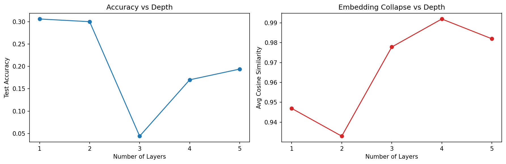
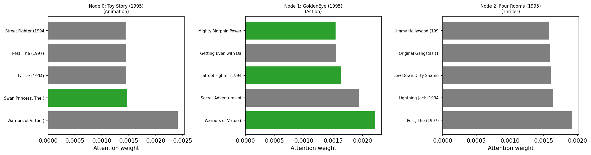
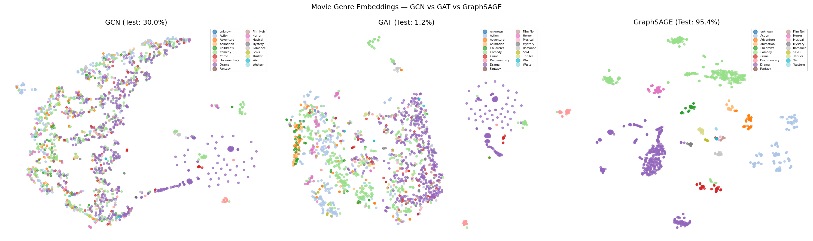

# A5: Graph Neural Networks — Results

Genre prediction and recommendation on MovieLens-100k, implementing GCN, GAT, and GraphSAGE from scratch.

---

## Exercise 1: Over-smoothing — How Deep is Too Deep?

### Results

| # Layers | Test Accuracy | Avg Cosine Similarity |
|---|---|---|
| 1 | 30.60% | 0.9470 |
| 2 | 30.00% | 0.9330 |
| 3 | 4.40%  | 0.9778 |
| 4 | 17.00% | 0.9919 |
| 5 | 19.40% | 0.9820 |

### Over-smoothing Plot

### Discussion

Accuracy holds steady at 1–2 layers (~30%) and drops sharply at 3 layers (4.40%), which is also where cosine similarity jumps from ~0.93 to ~0.98 — the point at which embeddings begin collapsing toward a single shared vector.

Each GCN layer computes `A_norm @ H @ W`, a weighted **average** over a node's neighborhood (including itself, via the self-loop). Averaging is inherently a smoothing operation — it pulls each node's representation toward its neighbors. Stacking `k` layers means a node's final representation is effectively an average over its entire `k`-hop neighborhood. On a densely connected graph like this movie co-rating graph, a node's `k`-hop neighborhood already covers a large fraction of the graph by `k=3`, so repeated averaging washes out the node-specific, genre-discriminative signal and replaces it with something closer to a global average. Mechanically, this is a low-pass filter applied repeatedly: enough applications flatten the high-frequency (discriminative) signal the classifier depends on.

---

## Exercise 2: GCN vs GAT vs GraphSAGE

### Results

| Model | Test Accuracy | Avg epoch time |
|---|---|---|
| GCN | 30.00% | ~4.2ms |
| GAT (8 heads) | 1.20% | ~55.3ms |
| GraphSAGE (k=10) | 95.40% | ~934.3ms |

### Attention Visualization

Top-5 attended neighbors for 3 sample nodes, green = same genre as the query node:
- Node 0 (*Toy Story*, Animation): 1/5 matched
- Node 1 (*GoldenEye*, Action): 3/5 matched
- Node 2 (*Four Rooms*, Thriller): 0/5 matched

Attention concentration was weak and inconsistent, top attention weights were only marginally larger than the rest (~0.001–0.002 range), with little separation between top and bottom neighbors. This is likely a consequence of high average node degree in the co-rating graph: nodes with hundreds of neighbors force softmax attention to spread thin, even when the model has learned a genuine preference. GAT's attention only sharpens meaningfully when a node's neighbor set is small and informative enough to discriminate between.

### When does each model win?

GAT should outperform GCN by the largest margin on graphs where neighbor importance varies a lot and neighbor counts are moderate — e.g. citation networks, where a paper cites both a foundational, highly relevant reference and several incidental ones, and the model benefits from learning to weight them differently. GraphSAGE should outperform GCN most on very large or dynamic graphs — e.g. billion-node social or e-commerce graphs, or settings where new nodes (users, items) appear after training and the model must generalize to them without retraining (inductive learning), which GCN's fixed adjacency matrix cannot support.

## Exercise 3: MLP Baseline — Does the Graph Actually Help?

### Results (original features — contain leakage)

| Model | Test Accuracy |
|---|---|
| MLP (no graph) | 96.80% |
| GCN | 30.00% |
| GAT | 1.20% |
| GraphSAGE | 95.40% |

### Results (leakage-free features — year only, no genre one-hot)

| Model | Test Accuracy |
|---|---|
| MLP (no graph) | 5.80% |
| GCN | 19.60% |
| GAT | 7.00% |
| GraphSAGE | 8.40% |

### Discussion

The original node features included the same one-hot genre columns used to derive the classification labels, so the MLP's 96.80% mostly reflects it reading off its own input rather than learning from context — not a meaningful "graph vs. no graph" comparison. After removing the genre columns (keeping only normalized release year), the MLP collapses to 5.80% — essentially random guessing over 18 classes (~5.5% baseline). GCN, using the same weak year-only feature plus graph structure, reaches 19.60%, roughly 3.5x random guessing — a clean demonstration that the co-rating graph structure alone carries real, learnable signal about genre. GraphSAGE's large drop (95.40% → 8.40%) is also consistent with this story: its concat-based aggregation (`[self || neighbor_agg]`) preserves each node's own feature largely intact, so it benefited heavily from the leaked genre signal and had comparatively less to gain from the graph itself once that leakage was removed.

---

## t-SNE Visualizations

GCN, GAT, and GraphSAGE movie embeddings (colored by genre), projected to 2D via t-SNE. No genre labels were used during training — genre clustering emerges purely from graph structure and the (mostly non-leaky, in the case of GCN) learned representations.

---

## Discussion: GNN vs. MLP

Use a GNN instead of an MLP when a data point's identity is meaningfully defined by its relationships, not just its own features — as this assignment showed, where genre was predictable from which movies were co-rated together even with almost no informative node feature to lean on. This generalizes to domains like biology (inferring a protein's function from its interactions in a protein-protein interaction network) or social networks (inferring a user's interests or fraud risk from their connections' behavior, not just their own profile). An MLP discards this relational structure entirely, so a GNN is worth the added complexity exactly when neighborhood information is doing real predictive work.

A5: Graph Neural Networks — st126425