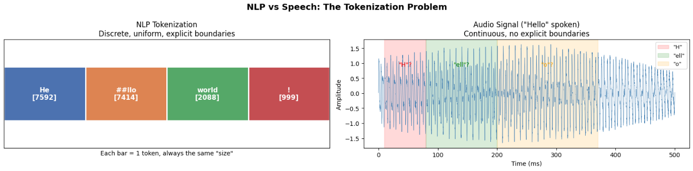
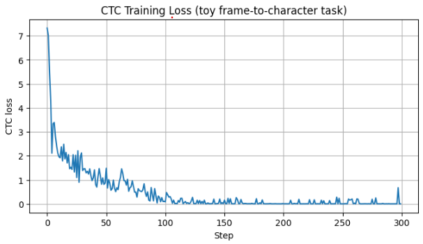
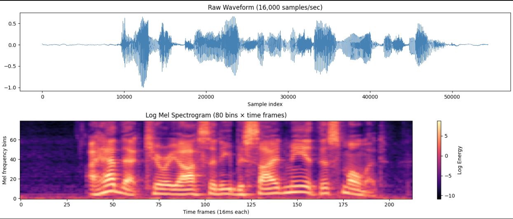
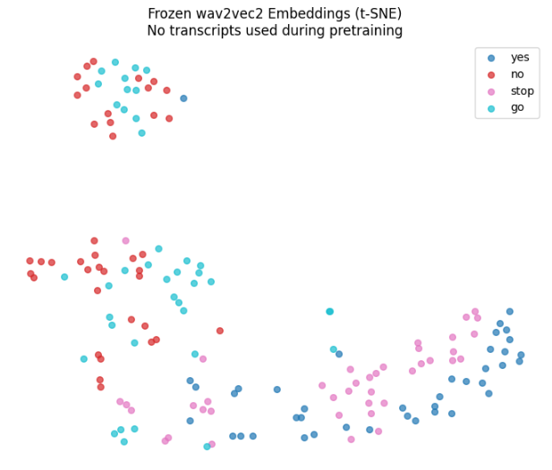
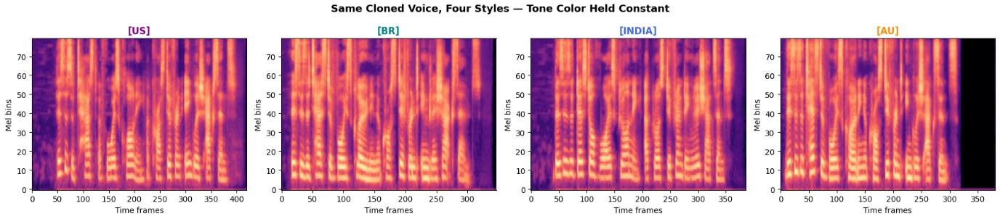

# A6 — Speech Processing
This assignment walks through the full speech-processing pipeline in five parts: speech tokenization (why audio needs different tokenization strategies than text), mel spectrograms (the waveform-to-2D bridge representation), CTC (implementing the alignment algorithm from scratch and training a tiny ASR model), wav2vec2 (linear-probing a frozen self-supervised speech encoder against a raw-feature baseline), and voice cloning with OpenVoice (extracting your own voice's tone color and applying it across accents and languages)
## Commands Used

```bash
# Train the toy CTC model (Part 3 / Exercise 2)
python3 run.py --model ctc --epochs 300 --train

# Linear-probe a pretrained wav2vec2 checkpoint (Part 4 / Exercise 3)
python3 run.py --model wav2vec2-probe --dataset speechcommands --classes yes,no,stop,go --train

# Extract tone color from reference clip
python3 run.py --model voice-clone --extract-se --reference data/voice_clone/my_voice.mp3

# Synthesize in a given style with cloned voice
python3 run.py --model voice-clone --accent us --text "I got the job!" --generate

# Synthesize all styles for comparison
python3 run.py --model voice-clone --accent all --text "Hello world" --generate

# Cross-lingual cloning
python3 run.py --model voice-clone --language es --text "Hola, como estas?" --generate
```

## Results Table

| Task | Model / Method | Result | Notes |
|---|---|---|---|
| Tokenization (Ex 1) | SpeechTokenizer | see table below | char vs. token count table |
| CTC character error rate (Ex 2) | Toy BiLSTM + CTC | 2.0% CER (final 50-step avg) | dropped below 10% around step ~113 |
| wav2vec2 vs raw-feature probe (Ex 3) | Linear probe | 83.3% vs 52.1% | wav2vec2 (frozen) vs. mel-spectrogram baseline; random baseline 25% |
| Voice cloning: accent + cross-lingual (Ex 4) | OpenVoice | cosine sim 0.73–0.81 across accents | identity preserved well but not perfectly disentangled from style |

### Exercise 1 — Tokenization

| Sentence | # Char tokens | # Tokens (w/ BOS/EOS) | Accent tag token ID |
|---|---|---|---|
| Hello, how are you? | 19 | 21 | — |
| Dr. Smith prescribed 10 tablets. | 36 | 38 | — |
| [EN-US] I got the job! | 15 | 17 | 36 |
| [EN-BR] I lost my wallet. | 18 | 20 | 37 |
| [EN-INDIA] This is completely unacceptable! | 33 | 35 | 38 |

### Exercise 4a — Voice cloning acoustic stats

* left to do --- > (fill in`duration / RMS / spectral centroid` numbers per accent from the `Exercise 4a` cell — table not reproduced here since exact values weren't logged in this session; re-run `python3 run.py --model voice-clone --accent all ...` plus the librosa stats snippet from Part 5 to populate.)*

### Exercise 4b — Cosine similarity of tone color across accents

| Accent | Cosine similarity to reference |
|---|---|
| us | 0.8094 |
| br | 0.7537 |
| india | 0.7860 |
| au | 0.7282 |

## Visualizations
- Tokenization comparison: NLP tokens vs. speech chars vs. accent tokens

- CTC greedy decoding grid + character error rate curve 

- wav2vec2 vs. mel-spectrogram linear probe comparison + t-SNE plot 


- Mel spectrogram grid: same cloned voice across 4 accents 



## Discussion

Implementing CTC's forward algorithm showed me that ASR/TTS training isn't standard classification — it's optimizing over every valid frame-to-label alignment at once via alignment granularity (frames per character) is itself a real design choice that changes task difficulty, as confirmed by CER tracking loss almost exactly across my experiments. A tone color embedding is fundamentally different from a text token or CTC blank: it's a continuous, extracted representation of who is speaking, not a discrete symbol from a fixed vocabulary conditioning what is said. The Exercise 4b cosine-similarity results suggest OpenVoice's identity/style disentanglement is a soft, empirical property rather than a guaranteed architectural boundary.


